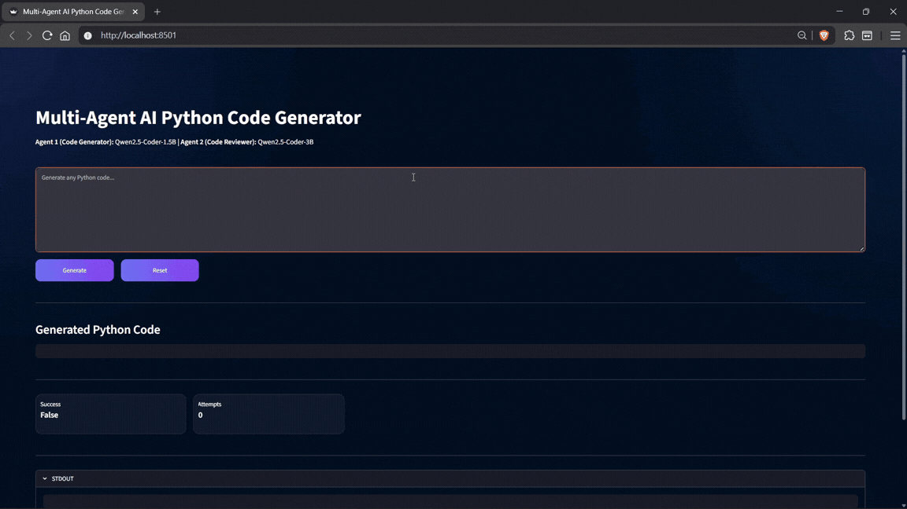
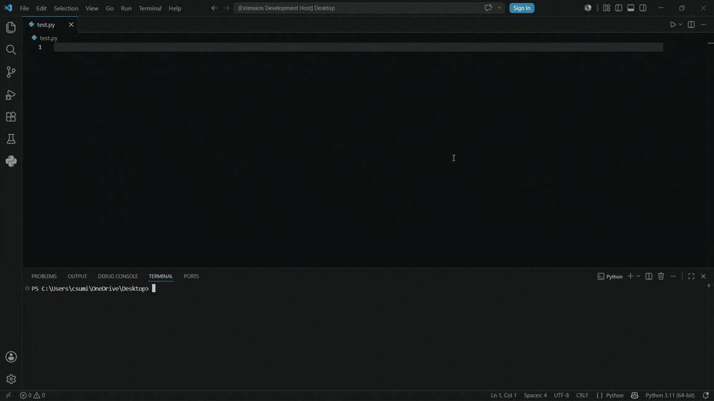
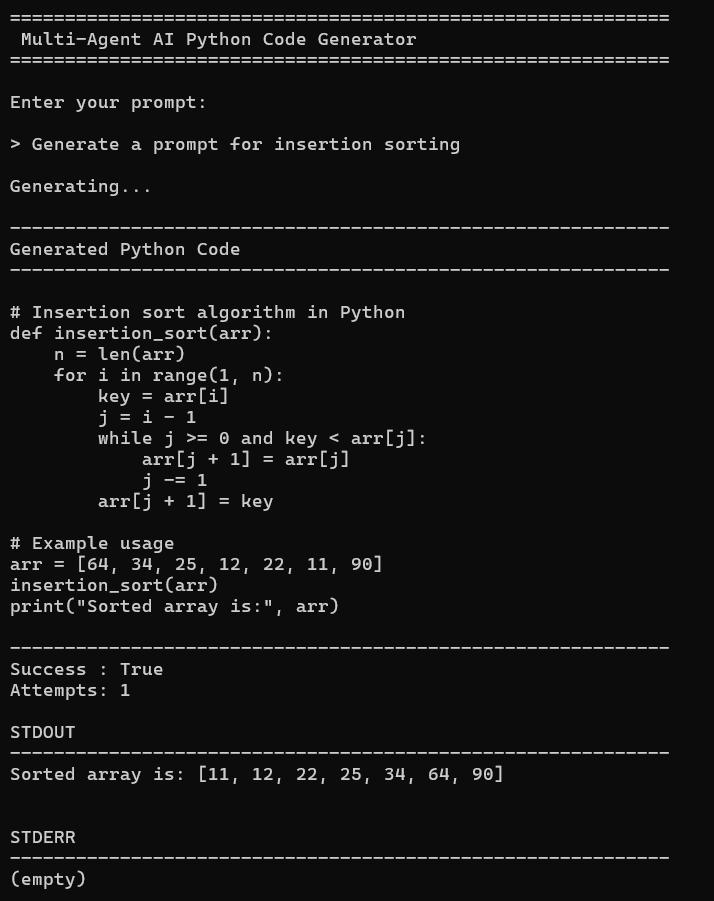

# Multi-Agent AI Suite

Local multi-agent AI Python code generator with a Web UI, CLI, and VS Code extension powered by open-source Qwen models.



The Streamlit application provides a browser-based interface for generating Python code. User prompts are sent to a FastAPI backend which coordinates the code generation and review agents before returning the final output.

---

## Features

* Multi-agent architecture
* Local LLM inference
* Streamlit web application
* Command line interface
* VS Code extension
* FastAPI backend
* Sandboxed code execution
* Import validation
* Offline operation

---

## Website


This is where you can generate Python code through a browser interface.

---

## VS Code Extension



The VS Code extension communicates directly with the local FastAPI backend and inserts generated code into the active editor. This allows code generation without leaving Visual Studio Code.

---

## Command Line Interface



The CLI offers a lightweight terminal experience for interacting with the code generation pipeline. Prompts are sent to the backend and generated code is displayed directly in the console.

---

## Architecture

```text
User
 │
 ├── Streamlit UI
 ├── CLI
 └── VS Code Extension
         │
         ▼
    FastAPI Backend
         │
         ▼
     Orchestrator
         │
 ┌───────┴───────┐
 │               │
 ▼               ▼
Code Agent   Review Agent
         │
         ▼
      Sandbox
         │
         ▼
 Generated Python Code
```

---

## Repository Structure

```text
multi-agent-ai-suite
│
├── assets
│
├── multi-agent-ai
│   ├── agents
│   ├── backend
│   ├── cli
│   ├── frontend
│   ├── models
│   ├── pipeline
│   └── main.py
│
└── multi-agent-ai-vscode
    ├── src
    └── package.json
```

---

## Technology Stack

### Backend

* Python
* FastAPI
* PyTorch
* Hugging Face Transformers

### Frontend

* Streamlit

### Extension

* TypeScript
* VS Code Extension API

### Models

* Qwen2.5-Coder-1.5B-Instruct
* Qwen2.5-Coder-3B-Instruct

---

## Requirements

* Python 3.11+
* Git

Optional:

* NVIDIA GPU
* Node.js and npm (required for the VS Code extension)

---

## Installation

### Clone the Repository

```bash
git clone https://github.com/csumitwr/multi-agent-ai-suite.git
```

### Navigate to the Python Project

```bash
cd multi-agent-ai-suite/multi-agent-ai
```

### Install Dependencies

```bash
pip install -r requirements.txt
```

---

## Install PyTorch

PyTorch is intentionally not included in `requirements.txt` because installation differs between CPU and GPU systems.

### CPU

```bash
pip install torch
```

### NVIDIA GPU

Install the CUDA-enabled version that matches your system using the official PyTorch installation guide:

https://pytorch.org/get-started/locally/

Example:

```bash
pip install torch torchvision torchaudio --index-url https://download.pytorch.org/whl/cu128
```

---

## Download Models

```bash
python models/download_model.py
```

---

## Running the Project

### Launch Menu

```bash
python main.py
```

Choose:

```text
1. Launch Web Application
2. Launch CLI
```

---

### Manual Startup

Backend:

```bash
uvicorn backend.app:app --reload
```

Frontend:

```bash
streamlit run frontend/app.py
```

---

## VS Code Extension Setup

Please make sure the backend is running in the background (How to do that is mentioned above).

Open the folder in visual studio code (This is needed). Activate a virtual environment. Inside Terminal run the following command

```bash
cd multi-agent-ai-vscode

npm install
```

Press:

```text
F5
```

A new Extension Development Host window will open.

Open a Python file and run:

```text
Ctrl + Shift + P
```

Then select:

```text
Hello World
```

After that a text box will appear where you can enter the prompt. It will generate and paste the code directly inside the active file.

---

## Future Improvements

* Additional specialized agents
* More programming languages
* Improved review workflows
* Packaged VS Code extension
* Enhanced prompt engineering

---

## License

MIT License